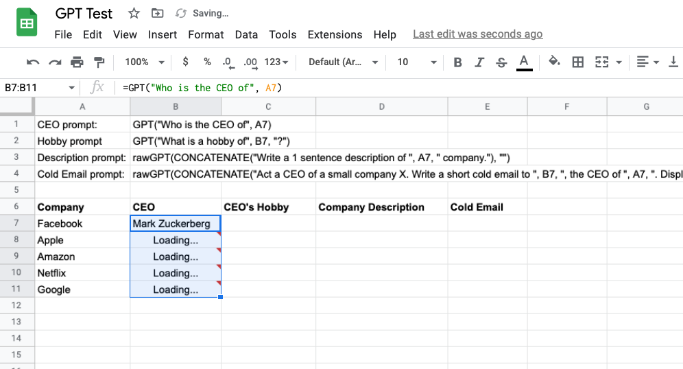
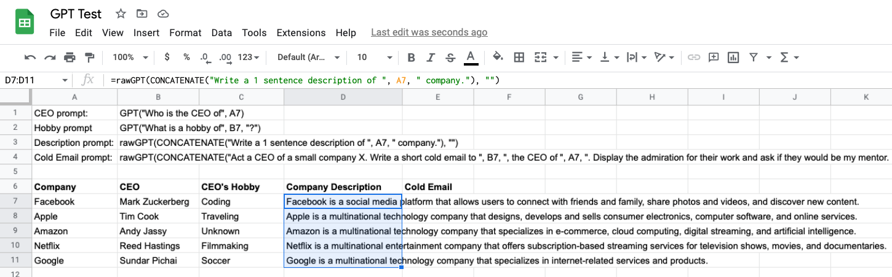

# ChatGPT in Google Sheets

ChatGPT in Google Sheets integrates OpenAI's GPT-3 language model into Google Sheets, enabling users to generate responses based on dynamic prompts or personalized data.

## Why use Google Sheets + ChatGPT?
* Create dynamic prompts that change based on the data in the cells. For example, generate a response based on the topic in cell A7 using the formula: =GPT("Make a comma-separated list of top 3 products from", A7, "by the number of users").
* Personalize prompts and generate customized responses using data from cells. For example, write a personalized email to the person in cell A7 and company in cell B7 using the formula: =rawGPT(CONCATENATE("Act a CEO of a small company X. Write a short cold email to ", B7, ", the CEO of ", A7), "").
* Automate the process of generating responses from the ChatGPT in a Google Sheet. Set up a sheet that generates responses for a set of prompts using drag and drop, and the responses will update automatically when the sheet is opened or refreshed. Copy and paste values if don't want this behaviour.

...

## Setup

1. Get an API key from https://platform.openai.com/account/api-keys.
2. Open Google Sheets, go to "Extensions" -> "Apps Script".
3. In the script editor, create a new script file and paste the contents of `chatgpt.gs` from this repository.
4. Replace the `OPENAI_API_KEY` variable in the script file with your API key.
5. Save the script file and go back to your Google Sheets document.
6. You should now be able to use the `GPT` and `rawGPT` functions in your sheets.

## Usage

### GPT function

The `GPT` function can be used to get a short answer from ChatGPT based on a prompt. The function automatically concatenates the inputs to create a prompt which is sent to ChatGPT. To use the function, enter the following formula in a cell:

=GPT(prompt)

Where `prompt` is the input you want to send to ChatGPT. For example:

=GPT("Who is the CEO of", A7, "?")

The function will return a short answer without punctuation at the end. If you need a longer response, you can use the `rawGPT` function instead.

### rawGPT function

The `rawGPT` function can be used to send a prompt to ChatGPT and get an unmodified answer. To use the function, enter the following formula in a cell:

=rawGPT(prompt, systemContent)

Where `prompt` is the input you want to send to ChatGPT and `systemContent` is parameter that specifies the system content prompt. If you want to leave out `systemContent`, pass `"""`. For example:

=rawGPT("Can you tell me about the history of New York City?", "")

The function will return the unmodified answer from ChatGPT.

You can also use the `CONCATENATE` function to combine multiple fragments of the prompt. For example:

=rawGPT(CONCATENATE("Can you tell me about the history of ", A1, "?"), "")

### OpenAI GPT models
To learn more about prompts and how they work with the OpenAI GPT models, check out the OpenAI documentation on prompts. Prompts are a powerful tool for generating human-like text from machine learning models, and can be used to create everything from short, snappy responses to longer, more detailed passages of text. By experimenting with different prompts and tweaking various parameters, you can fine-tune your OpenAI models to generate the type of content you need.
[https://platform.openai.com/docs/guides/chat](https://platform.openai.com/docs/guides/chat)

## License

This project is licensed under the MIT License - see the [LICENSE](LICENSE) file for details.
